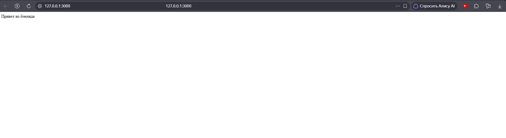
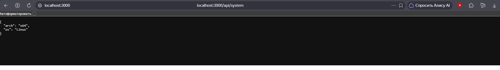
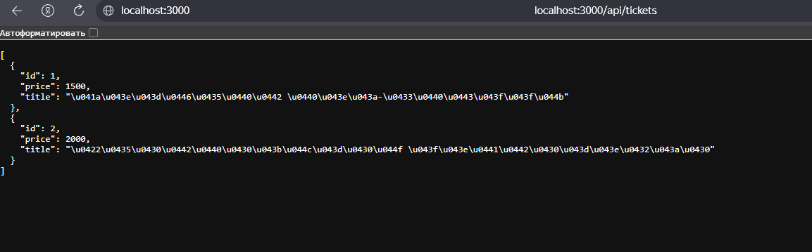
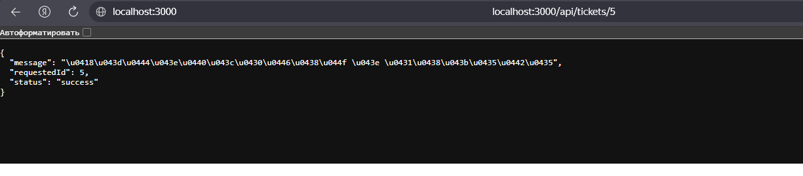
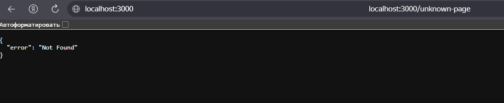

# Лабораторная работа №1: Настройка среды разработки и первый HTTP-сервер

**Вариант:** 9 (Повышенный уровень / Максимальные баллы)  
**Технологии:** Python (Flask) & Node.js (Express)  

---

## 📌 Цель работы

Освоить установку инструментов для бэкенд-разработки, создать и запустить минимальный веб-сервер, обрабатывающий GET-запросы, понять концепцию эндпоинтов, научиться настраивать автоматический перезапуск сервера.

---

## 🗂️ Структура проекта

Проект выполнен на двух языках программирования в отдельных директориях:

- `lab1-backend python/` — реализация на Python с использованием фреймворка Flask.
- `lab1-backend js/` — реализация на Node.js с использованием фреймворка Express.

---

## 💻 Что реализовано в коде (Разбор решения)

Для выполнения **9 варианта на повышенный уровень** в коде каждого сервера реализованы следующие компоненты:

1. **Корневой эндпоинт (`/`):** Возвращает текстовое приветствие (*«Привет из бэкенда»*).
2. **JSON-эндпоинты (`/api/system`, `/api/tickets`, `/api/events`, `/api/departments`):** Отдают структурированные данные (информацию об ОС, списки билетов, мероприятий и справочник отделов).
3. **Эндпоинт с динамическим параметром (`/api/tickets/:id` / `/api/tickets/<int:ticket_id>`):** Принимает ID из адресной строки и возвращает его в формате JSON (требование повышенного уровня).
4. **Кастомная обработка ошибки 404:** Перехватывает несуществующие страницы и возвращает красивый JSON-ответ `{"error": "Not Found"}` со статусом 404.
5. **Консольное логирование:** Фиксирует в терминале каждый входящий запрос (время, HTTP-метод и путь), что соответствует продвинутому уровню.

---

## 🚀 Полная инструкция по запуску сервера (Python & Node.js)

### Вариант 1. Запуск проекта на Python (Flask)

Для работы потребуется установленный интерпретатор Python.

1. Открой папку с Python-проектом в VS Code (`lab1-backend python`).
2. Открой встроенный терминал (`Ctrl + ~` или вкладка *Терминал ➔ Новый терминал*).
3. Создай виртуальное окружение (выполняется один раз при первом запуске):

```bash
python -m venv venv
```

4. Активируй виртуальное окружение:

- *На Windows (в PowerShell или CMD):*

```bash
venv\Scripts\activate
```

- *На macOS / Linux:*

```bash
source venv/bin/activate
```

*(После успешной активации в начале строки терминала появится надпись `(venv)`).*

5. Установи веб-фреймворк Flask:

```bash
pip install flask
```

6. Запусти сервер:

```bash
python app.py
```

7. **Результат:** В терминале появится строка с адресом `http://127.0.0.1:3000`. Нажми на неё с зажатой клавишей `Ctrl` или открой в браузере.

8. **Как остановить сервер:** Нажми комбинацию клавиш **`Ctrl + C`** в терминале.

### Вариант 2. Запуск проекта на Node.js + Express (JavaScript)

Для работы потребуется установленная платформа Node.js.

1. Открой папку с JS-проектом в VS Code (`lab1-backend js`).
2. Открой встроенный терминал (`Ctrl + ~`).
3. Инициализируй проект и установи зависимости (если папка `node_modules` еще не создана):

```bash
npm init -y
npm install express
npm install --save-dev nodemon
```

4. Проверь файл `package.json`: убедись, что в секции `"scripts"` прописан скрипт для автоперезапуска:

```json
"scripts": {
  "dev": "nodemon app.js"
}
```

5. Запусти сервер:

```bash
npm run dev
```

6. **Результат:** Сервер запустится с помощью `nodemon` (он автоматически перезапускает приложение при сохранении изменений в коде `app.js`). В терминале появится сообщение об успешном запуске на порту `3000`.

7. **Как остановить сервер:** Нажми комбинацию клавиш **`Ctrl + C`** (при запросе подтверждения нажми `Y` и `Enter`).

---

## 🔍 Проверка работоспособности эндпоинтов

После запуска любого из серверов (Python или JS) открой браузер и проверь основные маршруты, вводя их в адресную строку:

- Главная страница (текст): `http://localhost:3000/`
- Системный JSON: `http://localhost:3000/api/system`
- Список билетов: `http://localhost:3000/api/tickets`
- Динамический параметр: `http://localhost:3000/api/tickets/5`
- Ошибка 404 (проверка кастомного ответа): `http://localhost:3000/unknown-page`

---

## 📸 Скриншоты работы эндпоинтов

* **1. Главная страница (Корневой эндпоинт `/`):**  
  Возвращает текстовое приветствие от сервера.  
  

* **2. Системные данные (`/api/system`):**  
  JSON-ответ с информацией о системе (архитектура и ОС).  
  

* **3. Список билетов (`/api/tickets`):**  
  JSON-массив со списком доступных билетов и их характеристик.  
  

* **4. Динамический параметр (`/api/tickets/5`):**  
  Обработка GET-запроса с переданным параметром ID (`5`) в строке запроса.  
  

* **5. Кастомная ошибка 404 (`/unknown-page`):**  
  Перехват несуществующего маршрута и возврат структурированного JSON-ответа с ошибкой.  
  

---

## ❓ Ответы на контрольные вопросы

1. **Что такое эндпоинт (endpoint)?**

   - Это конкретный URL-адрес совместно с HTTP-методом (например, `GET /api/system`), по которому клиент обращается к серверу за данными.

2. **Зачем используется `jsonify` (в Flask) или `res.json` (в Express)?**

   - Для того чтобы сервер формировал ответ в стандартизированном текстовом формате JSON, который понимают любые клиентские приложения (браузеры, мобильные клиенты).

3. **Как получить параметр из URL-пути (например, ID билета)?**

   - С помощью динамических сегментов маршрута (например, `/api/tickets/<int:ticket_id>` в Flask или `/api/tickets/:id` в Express) и последующего считывания через параметры запроса.

4. **Что такое middleware (в Express) / декораторы запросов (во Flask)?**

   - Это функции-перехватчики, которые выполняются автоматически до того, как запрос дойдет до основного обработчика (в нашей работе они применяются для консольного логирования).

5. **Зачем нужен автоматический перезапуск сервера (`debug=True` или `nodemon`)?**

   - Чтобы не перезапускать приложение вручную после каждого изменения в коде — сервер делает это сам сразу после сохранения файла, что сильно ускоряет разработку.

---

## 🏁 Вывод

В ходе выполнения лабораторной работы были успешно освоены базовые инструменты бэкенд-разработки на Python и JavaScript, настроена среда, созданы GET-запросы, JSON-ответы, обработка динамических параметров и логирование запросов. Все требования 9 варианта выполнены в полном объеме.
